Old exercise suggestions from Hartshorne for practice and possibly future blog posts.

**Chapter I, section 3:**
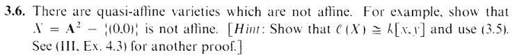
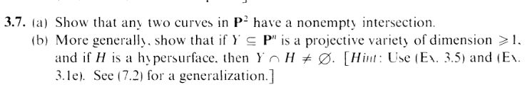
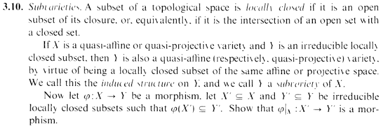
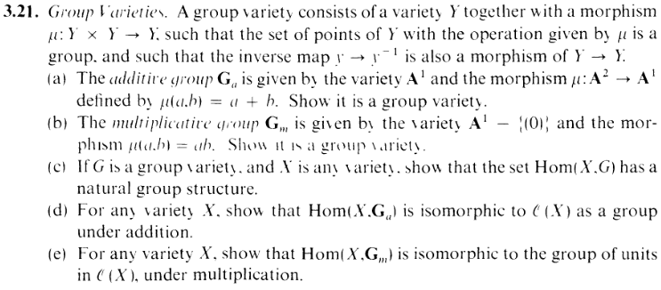
**Chapter II, setting up \(sections 1-4\):**  
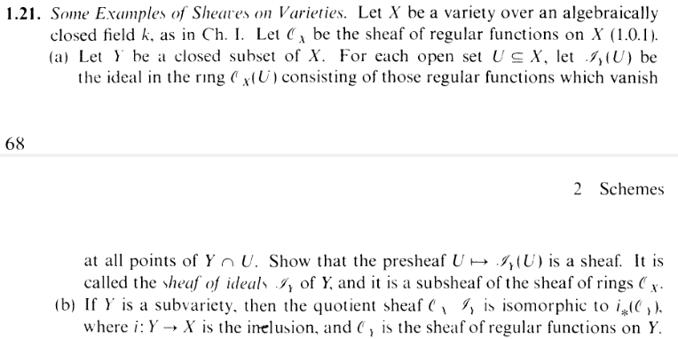
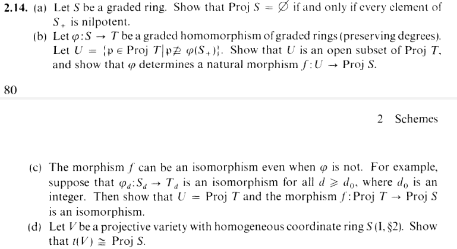
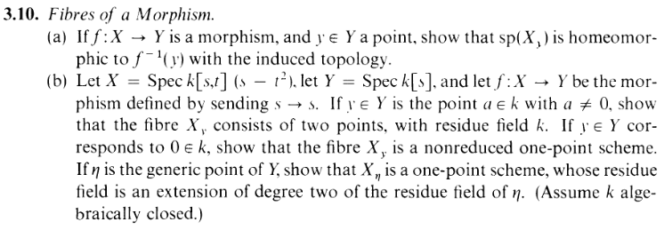
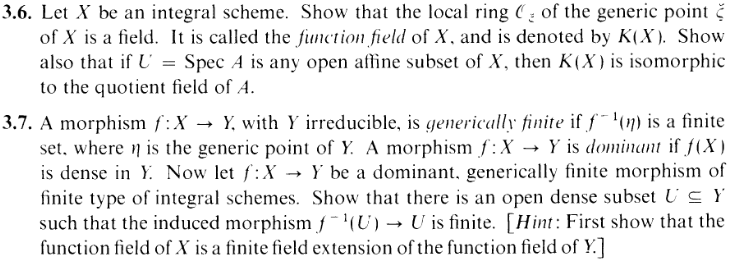
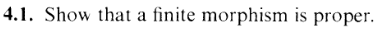
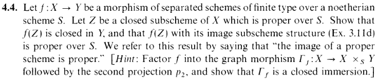
**Chapter II, calculations and stronger invariants \(sections 5-8\):**
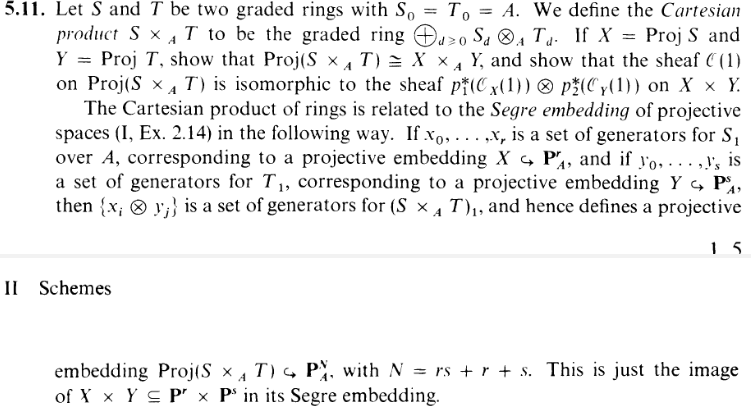
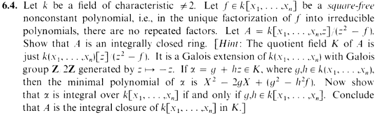
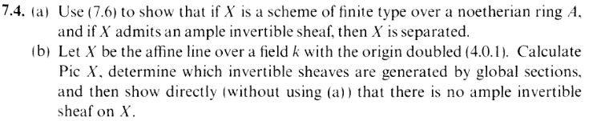
**Chapter III, developing cohomology \(sections 1-4\):**
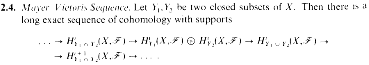
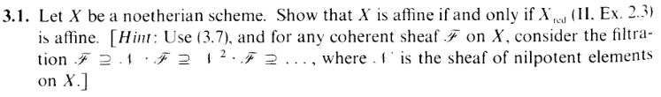
**Chapter III, results from cohomology \(sections 5-9\):**
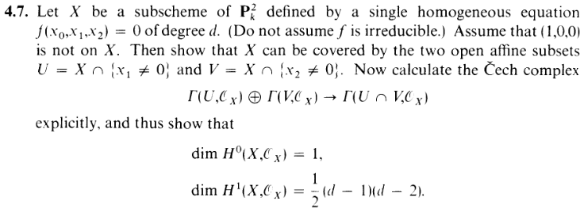
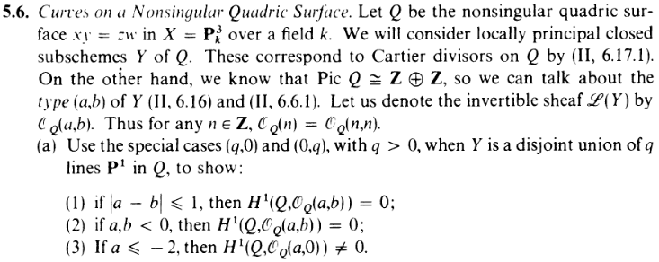
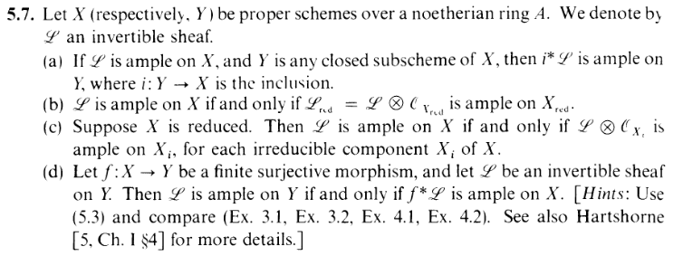