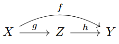

Over the last few days I've been learning some machinery used to analyse $\mathbb{G}_{m}$-actions in algebraic geometry. One of the results I've needed for this is Lüroth's theorem. In this write-up I will follow the proof given in Hartshorne, which makes the geometric content of the statement clear and establishes theory about morphisms of curves along the way. This is a favourite theme in my recent work - analysis of field extensions usually provides strong information about morphisms of varieties. I especially enjoy results in the characteristic $p$ case; the field theory developed on its own can feel overly complicated. 

The main result from curve theory we use is Hurwitz's theorem. In this note we will assume all curves are nonsingular projective, and make note if results extend more generally.

**Definition**: Let $f : X \to Y$ be a morphism of curves. We say $f$ is **separable** if the induced extension $K(X)/K(Y)$ of function fields is separable. 

**Hurwitz's Theorem**: Let $f: X \to Y$ be a finite separable morphism of curves, with degree $n = [K(X): K(Y)]$. Then 
$$
2g(X)-2 = n(2g(Y)-2) + \text{deg}(R),
$$
where $R = \sum_{p \in X} \text{length}(\Omega_{X/Y, \ p}) p$ is the **ramification divisor** and $g(X)$ is the (geometric) genus. 

If $f: X \to Y$ is a finite morphism of curves, then $K(X)/K(Y)$ is a finite extension and there is a subfield $L$ of $K(X)$ such that $K(X)/L$ is purely inseparable and $L/K(Y)$ is separable. By the equivalence of categories between fields of transcendence degree one and function fields of curves, to $L$ corresponds a curve $Z$ for which we have a factorisation .

We can use Hurwitz to study the separable part, so we are left to analyse the purely inseparable part $X \xrightarrow{g} Z$ (recall that inseparability is a characteristic $p$ phenomenon, so we can assume $X$ is defined over $\mathbb{Z}_{p}$ for some prime $p$).

**Definition**: Let $X$ be a scheme with local rings of characteristic $p$. The **Frobenius morphism** $F: X \to X$ is defined to be the identity map on the topological space of $X$, with corresponding sheaf morphism $F^{\#} : \mathcal{O}_{X} \to \mathcal{O}_{X}$ the $p$th power map. 

The local rings assumption ensures $F$ is a morphism. For a ring $A$, the map $$A \to A, a \mapsto a^p$$ is an additive homomorphism if and only if all middle terms of $(a+b)^p$ vanish for every choice of $a$ and $b$, which holds for every characteristic $p$ ring. 

If $X$ is a $k$-scheme and $k$ has characteristic $p$, the Frobenius morphism is not $k$-linear, instead satisfying $\pi F = F \pi$, where $\pi$ is the structure morphism $X \xrightarrow{\pi} \text{Spec}(k)$. This can be thought of as $k$-linearity for maps between two different $k$-schemes: let $X_p$ have the same scheme structure as $X$, but with structure morphism $\pi' = F \pi : X_{p} \to \text{Spec}(k)$.  Then our equation reads $\pi' = \pi F$, so that the Frobenius *is* a $k$-linear morphism $F' : X_{p} \to X$. To distinguish the two perspectives we call $F'$ the **$k$-linear Frobenius morphism**.

**Proposition**: Let $f: X \to Y$ be a finite morphism of curves such that $K(X)/K(Y)$ is a purely inseparable extension. Assume $X$ and $Y$ are defined over an algebraically closed field $k$ of characteristic $p$. Then $X$ and $Y$ are isomorphic as abstract schemes (excluding the structure morphisms) and $f$ is a composition of $k$-linear Frobenius morphisms. In particular, $g(X) = g(Y)$. 

**Proof**: The $k$-linear Frobenius map $Y_{p} \to Y$ corresponds on function fields to the injection $K(Y) \xhookrightarrow{\hat{} \, p} K(Y)$, which is a degree $p$ extension $K(Y)/K(Y)^p$. The extension is equivalent to the extension $K(Y)^{1/p}/K(Y)$ where the top field is obtained by adding all $p$th roots in an algebraic closure of $K(Y)$ to $K(Y)$, in the sense that there is an isomorphism $K(Y) \cong K(Y)^{1/p}$ which sends $K(Y)^p$ to $K(Y)$. 

Now if $K(X)/K(Y)$ is finite and purely inseparable in characteristic $p$, its degree is $p^r$ for some $p$. Since $K(X)^{p^r} \subseteq K(Y)$ we have $K(X) \subseteq K(Y)^{1/p^r}$, and since $K(X)/K(Y)$ and $K(Y)^{1/p^r}/K(Y)$ both have degree $p^r$ we see that $K(X) = K(Y)^{1/p^r}$. The sequence of curve morphisms $$Y_{p^r} \xrightarrow{F'} Y_{p^{r-1}} \xrightarrow{F'}  \dots \xrightarrow{F'} Y_{p} \xrightarrow{F'} Y$$ with $Y_{p^r} = (Y_{p^{r-1}})_{p}$ for $r \geq 1$ realises $K(Y)^{1/p^r}$ as the function field of a finite purely inseparable morphism $Y_{p^r} \xrightarrow{(F')^r} Y$, so since nonsingular projective curves are determined up to isomorphism by their function fields we see that $X \cong Y_{p^r}$. $\square$ 

The moral of this result is that the interesting finite morphisms of curves are exactly the separable ones (the inseparable part has a standard form). This means that Hurwitz's theorem is essentially a universal tool for studying these morphisms. 

**Lemma**: Let $f : X \to Y$ be a finite morphism of curves, $g(Y) \geq 1$. Then $g(X) \geq g(Y)$. 

**Proof**: As discussed above, we can factor into a separable and a purely inseparable part, and genus is unchanged for the purely inseparable part of the extension. Assume without loss of generality that $f$ is separable. Then we can rearrange the formula from Hurwitz's formula: 
$$
\begin{aligned} 2&g(X) - 2 = n(2g(Y) -2) + \text{deg}(R) \\ \implies &g(X) = n(g(Y)-1) + \frac{1}{2}\text{deg}(R) + 1 \\ = \ &g(Y) + (n-1)(g(Y)-1) + \frac{1}{2}\text{deg}(R).  \end{aligned}
$$
In the right-hand side, the ramification divisor has non-negative degree and $n, g(Y) \geq 1$, so we see that $g(X) \geq g(Y)$. $\square$

Using the formula in the lemma, we have $g(X) = g(Y)$ if and only if $\text{deg}(R) = 0$ and either $n =1$ or $g(Y) = 1$. In other words, there are no finite morphisms between non-isomorphic curves of genus $\geq 2.$ We have yet to cover the genus 0 case, which we handle separately since we can say more. 

**Definition**: A curve $Y$ is **simply connected** if for every finite étale morphism $f: X \to Y$, $X$ is isomorphic to the disjoint union of $\text{deg}(f)$ copies of $Y$. We say $Y$ has **no nontrivial étale covers**.

**Remark**: The Frobenius morphism (and thus any inseparable extension) is not an étale cover. In fact, $F'$ is everywhere ramified: since $F'$ induces the $p$th power map on local rings, if $Q \in Y$ is any point and $t$ a local parameter at $Q$ we have $F^{'\small\#}t = t^p$ with valuation $p$ in $\mathcal{O}_{Y, Q}$. 

**Lemma**\[[HS IV-1.3.5](https://link.springer.com/book/10.1007/978-1-4757-3849-0)]: Let $X$ be a (nonsingular projective) curve. Then the following are equivalent:
 <ol>
 <li>(a) $X$ is rational</li>
 <li>(b) $g(X) = 0$</li>
 <li>(c) $X$ is isomorphic to $\mathbb{P}^1$.</li>
 </ol>

**Lemma**: $\mathbb{P}^1_{k}$ is simply connected. 

**Proof:** Let $f : X \to \mathbb{P}^1_{k}$ be a finite étale morphism, and assume $X$ is connected. Then $X$ is smooth over $k$  (composition of smooth morphisms is smooth) and proper because $f$ is finite, which makes $X$ a curve. A finite étale morphism of curves is separable, so by Hurwitz's theorem $$2g(X) - 2= -2n.$$ Since $n \geq 1$ and $g(X) \geq 0$, this identity holds if and only if $n =2$, $g(X) = 0$. By the lemma above, we conclude that $X \cong \mathbb{P}^1$. $\square$

**Lüroth's Theorem**: Let $k$ be an algebraically closed field. If $k(t)/k$ is a purely transcendental extension of degree 1, any subfield $L$ is also purely transcendental over $k$. 

**Proof**: Assume that $L \neq k$, so that $L$ has transcendence degree 1. Then $L$ is the function field of a curve, and the extension $k(t)/L$ is finite (or else $k(t)$ would have transcendence degree $\geq 2$) corresponding to a finite morphism $f: \mathbb{P}^1_{k} \to Y$ ($K(Y) = L$).  By the genus inequality $Y$ cannot have genus $g(Y) \geq 1$, so $g(Y) = 0$ and $Y \cong \mathbb{P}^1$. It follows that $Y \cong k(u)$ for some $u$. $\square$