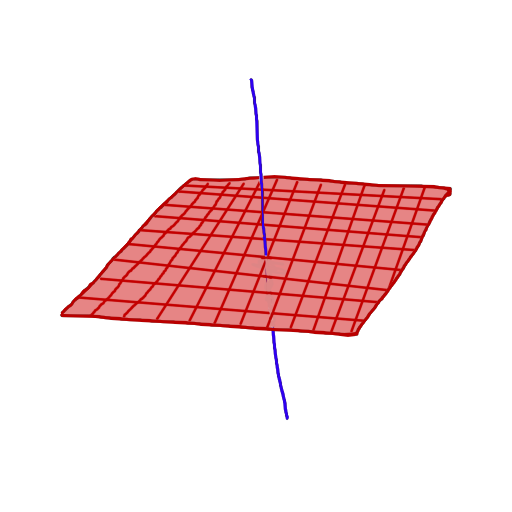

One of the more frustrating problems in day-to-day ring theory is determining isomorphisms of rings. In algebraic geometry it is often the case that problems involve adding or removing variables subject to equations to polynomial rings (geometric content: going up and down in dimension, which we do for blowups, vector bundles, covers, cones, etc), and there is no silver bullet for finding the simplest description of such rings. To the beginner in algebraic geometry it is difficult to know what options we have for speeding up these calculations, either through existing algorithms or variants we construct ourselves. Statements which appear obvious can turn out to be difficult, even equipped with the usual tricks like the Nullstellensatz.  

Today I spent a few hours solving one of these problems, aiming to reinforce my improvisation skills on the problem and develop some new techniques. I am studying towards understanding virtual fundamental classes, for which I first need some basic intersection theory. This has lead me to learning about normal cones and (soon) obstruction theory. As a first step to this I am looking at the normal cone to the projective variety $X = V(xz, yz) \subseteq \mathbb{P}^3_{[x:y:z:w]}$ (below: a picture of $X$ in the affine chart $w \neq 0$). 

The scheme-theoretic definition of the normal cone is as a relative spectrum, defined by gluing together spectra over the affine open sets in $X$,  so to understand the cone we can study it over the chart $U_w = \{w \neq 0\}$. We have $X \cap U_w = V(xz, yz)$  (this time, the affine vanishing locus) given by ideal $I = (xz, yz)$, so that the normal cone has description $C_{X/\mathbb{P}^3}|_{U_w} = \text{Spec}(\bigoplus_{n\geq 0}I^n/I^{n+1})$.  Writing $R = \mathbb{C}[x, y, z]/(xz, yz)$ for the coordinate ring of $X\cap U_w$, I wanted to show that $$\bigoplus_{n\geq 0} I^n/I^{n+1} \cong  R[A, B] /(yA - xB).$$

The general technique I used is an inductive argument on relations. Since the map $$\varphi: R[A, B] \to \bigoplus_{n\geq 0} I^n/I^{n+1}, A \mapsto xz, B \mapsto yz$$ is a surjective graded homomorphism, the kernel is a homogeneous ideal, so we need to show that for every degree $n$ relation $$S = \sum_{i=0}^{n} r_{i} A^{n-i}B^i, \quad \varphi(S) = 0 \implies S \in (yA - xB).$$
In this example, the variable $z$ is irrelevant to the relation being 0 because $\varphi(r_iA^{n-i}B^i)$ is always divisible by $z^n$; we have $\varphi(A^{n-i}B^i) = z^n x^{n-i}y^i$, so to cancel terms each $r_i$ will need to be divisible by either $x$ or $y$, and *this* means that if $z$ divides $r_i$ as well the term was already zero in $R[A, B]$. Returning to generalities, a more precise formulation of the idea we will use is the following: 
	1. Deduce some divisibility statement on the coefficient $r_i$.
	2. Show that this information gives us a relation $S'$ with the same image in $\bigoplus_{n\geq 0} I^n/I^{n+1}$ and which is reducible; induction says that $S'$ lives in the target ideal.
	3. Look at the difference $S - S'$; if this lives in the target ideal then we see that $S$ does as well. 
Of course, there is a little yoga to this: we need to choose $S'$ so that step 3 will happen in the way we expect. For ideals generated by one linear homogeneous polynomial this isn't too difficult, but the reasoning could get more complicated with more variables and in more degrees. 

In our set-up, (1) is easy: we need to have $y \  | \ r_0$ and $x \ | \ r_{n}$ in order for these terms to appear and be nonzero in $S$, because all terms other than $A^n$ have image divisible by $y$ and all terms other than $B^n$ have image divisible by $x$.  So then $$S' = \frac{xr_{0}}{y}\cdot BA^{n-1} + \sum_{i=1}^n r_{i} A^{n-i}B^i$$ has the same image and factorises as $$B\left( \frac{x r_{0}}{y} A^{n-1} + \sum_{i=1}^n r_{i}A^{n-i}B^{i-1} \right),$$ which maps to 0 if and only if the bracketed term does. This gives us step (2); for step (3) the difference is $$S - S' = r_{0}A^n - \frac{xr_{0}}{y}A^{n-1}B,$$ and taking out the factor $\frac{r_{0}}{y}A^{n-1}$ leaves us with $yA - xB$. 

As an **exercise**, one can check that the same holds for the affine normal cone over $V(x^2, xy) \subseteq \mathbb{A}^2$; with $R = \mathbb{C}[x,y]/(x^2, xy)$ we have $$\bigoplus_{n\geq 0} I^n/I^{n+1} \cong R[A, B]/(yA - xB)$$ using the surjective graded homomorphism of $R$-algebras $A \mapsto x^2, B \mapsto xy$. 