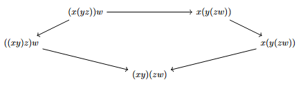
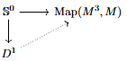
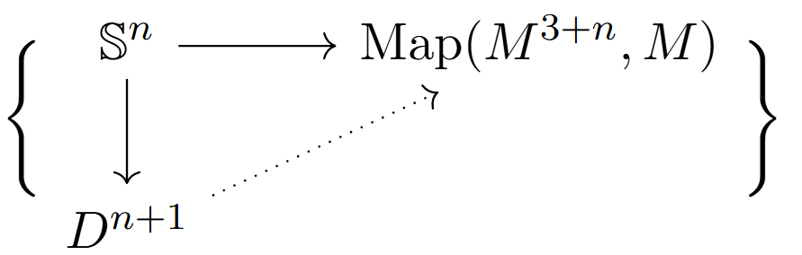
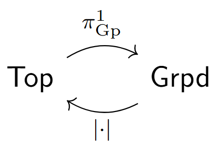
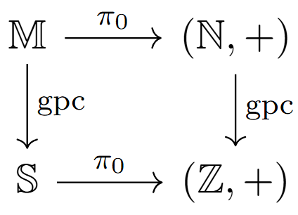
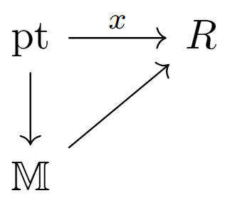
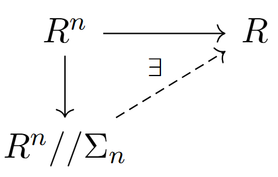
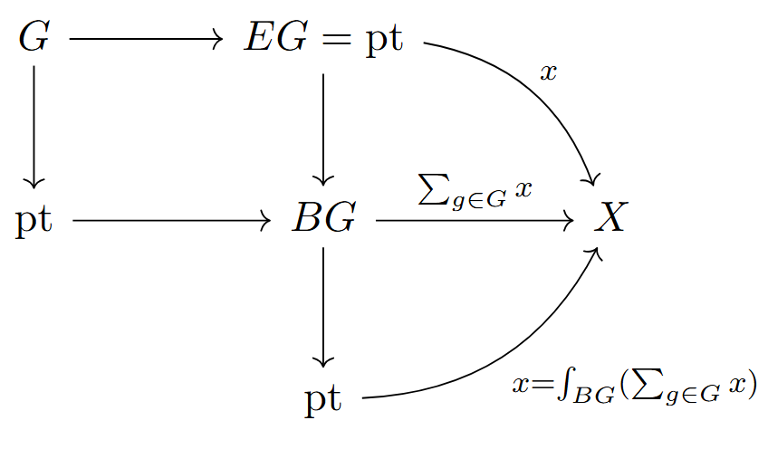
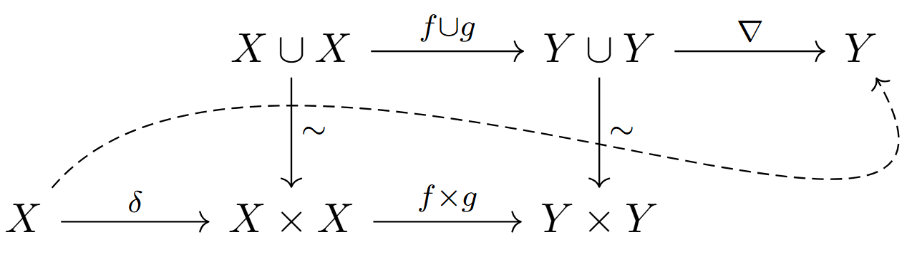

import { StaticImage } from "gatsby-plugin-image"

### Goal 
A setting where we can do homotopy theory with monoids within a category. 
	- Topological monoids (common approach to $\infty$-category of objects) are too rigid
	- Monoids in the homotopy category of $\mathsf{Top}$ are too loose.

A middle ground is the category of **homotopy coherent** monoids, tensor categories with commuting Stasheff pentagons and higher diagrams:

### Framing associativity as a coherence problem 
For a homotopy theorist, associativity of multiplication for a monoid $M$ is connected to existence of extensions fitting in a diagram

(using the appropriate sphere/disk objects in the category, eg coming from initial/terminal objects and categorical constructions).
More generally, we have a family of extension problems 

 
    

    ,

and we define a **homotopy coherent monoid** to be a monoid equipped with solutions to these extension problems for all $n$. 

**Inverses**: Let $M \times M \xrightarrow{s} M \times M$ be the *shear* map $(x,y) \mapsto (x, xy)$. Then $M$ is a group if and only if $s$ is a bijection.

**Definition**: A **homotopy coherent (hc) group** is a hc monoid such that $s$ is a homotopy equivalence. 

<u>Example:</u> For $Y$ a topological space, $X = \Omega Y = \text{Map}_{*}(\mathbb{S}^1, Y)$ (the basepoint-preserving maps for fixed basepoint of $Y$) is a hc group.

(rough statement of) **Theorem:** Homotopy coherent groups correspond bijectively to loop spaces.

Recall that the Eckmann-Hilton argument says that if a space $X = X_0$ is isomorphic to $\Omega^2 X_2$ for some other space $X_2$, $\pi_{2}(X) = \pi_{0}(X_{2})$ is abelian. Since fundamental groups may be interpreted as maps from $\mathbb{S}^n$ into $X$, we see that if there are spaces $X_m$ such that $X = \Omega^m X_m$, the homotopy groups $\pi_m(X)$ will be abelian for $m \geq 2$. Combining with the above theorem, this should imply that homotopy coherent commutative groups correspond to infinite loopspaces.
<u>Examples</u>: 
- Let $(\mathscr{C}, \otimes, \mathbb{1})$ be a symmetric monoidal category. Then we usually assume 
$$
X\otimes (Y \otimes Z) \simeq (X \otimes Y) \otimes Z
$$ 
up to isomorphism, together with higher coherence of the isomorphisms (Stasheff pentagon is used as an associator and implies higher diagrams). These coherences can be thought as belonging to the subcategory consisting of objects and invertible morphisms (so there is a groupoid perspective on this).

- Recall that we have functors 

taking the fundamental groupoid in one direction and the geometric realisation in the other. For example, the geometric realisation of the *classifying groupoid* $\mathbb{B}G$ (category with one object and $G$ as its group of automorphisms) is the **classifying space** $|\mathbb{B}G| = BG$. Applying the geometric realisation construction to the category $\mathsf{Fin}^{\simeq}$ of finite sets up to isomorphism (objects: one for each natural number $n$, no morphisms between different sets and $\text{Hom}(n,n) = \Sigma_{n}$ the symmetric group on $n$ elements) gives 
$$
|\mathsf{Fin}^{\simeq}| = \coprod_{n \in \mathbb{N}} B\Sigma_{n} =: \mathbb{M},
$$
which has a homotopy coherent commutative monoid structure given by disjoint union. The resulting monoid is the free monoid on one element (note: the monoid itself is not commutative but its higher associations are). Applying $\pi_{0}$ gives the monoid $(\mathbb{N}, +)$, which we can group-complete to get $(\mathbb{Z}, +)$.  The corresponding 'group completion' object of $\mathbb{M}$ turns out to be the *sphere spectrum* 
$$
\mathbb{S} = \varinjlim (\mathbb{S}^0 \to \Omega \mathbb{S}^1 \to \Omega^2 \mathbb{S}^2 \to \dots),
$$ 
in the sense that we have a diagram 

 
    

    .

Of course, for this to be the right choice of completion we need more than just the same underlying monoid as the group completion, but I didn't catch this detail in the talk. For one hint in this direction, recall that by the Freudenthal suspension theorem, the sequence 
$$
\pi_{n}(\mathbb{S}) = \varinjlim_{k} \pi_{n}(\Omega^k(\mathbb{S}^k)) = \varinjlim_{k} \pi_{n+k}(\mathbb{S}^k)
$$ 
stabilises, so that if we draw a similar diagram at $\pi_{n}$ we are getting the *stable stems* of the sphere spectrum along the bottom. 

## Decategorification 
One use for homotopy coherent constructions is *decategorification*, reducing the full collection of hc data to structure which is easier to carry around. 

For a symmetric monoidal category $(\mathscr{C}, \otimes, \mathbb{1})$, the category $\pi_{0}(\mathscr{C})$ of isomorphism classes of objects in $\mathscr{C}$ is a commutative semiring under operations 
$$
\begin{aligned} \,[X] + [Y] &= [X\cup Y] \\ [X][Y] &= [X \otimes Y], 
\end{aligned}
$$ 
with group completion $K_{0}(\mathscr{C})$ a commutative ring. We have a **symmetric power** operation 
$$
S^n[X] = [X^{\otimes n}/\Sigma_{n}] \ (\text{coinvariants})
$$ 
using the action of $\Sigma_{n}$ on $X^{\otimes n}$, and often we can also form the **alternating power** operation $\bigwedge\nolimits^{n}[X] = [X^{\otimes n}/ \text{sgn}(\Sigma_{n})]$ (when we have a sign representation). If $\mathscr{C}$ is $\mathbb{C}$-linear, we also get a $\lambda$-ring structure on $K_{0}(\mathscr{C})$. 

<u>Examples</u> 
- Let $\mathscr{C} = \mathsf{Vect}_{\mathbb{C}}^{BG}$ be the category of complex vector bundles with structure group $G$ over a point. Then $K_0(\mathscr{C}) = \mathsf{Rep}(G)$ inherits a $\lambda$-ring structure, from the alternating power operation. 
- Let $\mathscr{C} = \mathsf{Fin}^{BG}_{\mathbb{C}}$ be the category of all finite sets admitting $G$-actions. Then $K_{0}(\mathscr{C}) = \mathsf{Burn}(G)$ is a ring, called the **Burnside ring** of $G$, with addition given by disjoint union of sets and multiplication by Cartesian product. 

<u>Remark</u>: The group completion of $\left( \coprod_{n \in \mathbb{N}} B\mathrm{GL}_{n}(\mathbb{C}), \oplus \right)$ in the category of spectra is an object usually denoted by $ku$, the spectrum of **topological complex K-theory**. The name comes from the fact that for a compact object $X$ in the category, $K_{0}(X) = [X, ku],$ the maps from $X$ to $ku$. With the tensor product $\otimes$ of complex vector space, $ku$ comes equipped with hc commutative ring structure. 

<u>Example - Power Elements</u> Let $R$ be any commutative ring spectrum (in the topological sense, so we have an infinite suspension diagram of rings). Then an element $x \in R$ can be thought of as an arrow in a diagram of hc objects 

. 

Since $\mathbb{M} = \coprod_{n \in \mathbb{N}} B\Sigma_{n}$ we have maps from the point to each one-point space $B\Sigma_{n}$. Now a map $B\Sigma_{n} \to R$ picks out an element $x^n \in R^{B\Sigma_{n}}$ the hc ring of all objects with automorphism group $\Sigma_{n}$ (identified with $\mathsf{Map}(B\Sigma_{n}, R)$), and we have $\pi_{0}(R^{B\Sigma_{n}}) = R^0(B\Sigma_{n}),$ where $R^0 = \pi_{0}(R)$ (so the RHS is the ordinary points of the ordinary ring $R$ which have $\Sigma_{n}$-automorphisms). Coherence is equivalent to the statement that the diagram 

 commutes, 
where the object on the bottom is the quotient groupoid (every object of $R^n$ has $\Sigma_{n}$-automorphisms). 
Now since we have an arrow $\alpha: R^0(\mathbb{M}) \to R^0$ as above, we get **power elements** $\alpha(x^m) \in R$ for all $m$ from our original diagram. (This is probably only partially correct, I am missing definitions and details to make this precise) I think we want this to explain the power elements/formal group laws of Lubin, Lurie et al  

- There is a *Thom spectrum* $MO$ such that $\pi_{n}(MO)$ is the category of stably framed smooth $n$-manifolds up to cobordism, and $[X, MO]$ gives *cobordism cohomology* for a topological space $X$. 
- The *Morava E-theories* form a sequence of commutative ring spectra, with 
	- $E_0 \approx \mathbb{C}$
	- $E_1 \approx k\hat{u_{p}}$ 
and higher $E$'s being related to things like Witt vector cohomology. I think these are used in topology to study torsion phenomena.
	
<u>Example</u>: The Hopf fibration can be constructed by decategorification. In the sphere spectrum, taking $x \in \Omega^2 \mathbb{S}^2$ we have arrows 
$$
1 \sim x\cdot x^{-1} \overset{ \ \sigma_{x,x^{-1}}}\sim x^{-1}\cdot x \sim 1
$$ 
(using a $\Sigma_{2}$-action on the product $x\cdot x^{-1}$); the loop corresponds to the Hopf map $\mathbb{S}^1 \to \Omega^2 \mathbb{S}^2$, ie $\mathbb{S}^3 \xrightarrow{\eta} \mathbb{S}^2$.

<u>Orbits</u>: If we have a categorical group action $BG \xrightarrow{Z} \mathscr{C}$ factoring through the one-point space $BG \to \text{pt} \to \mathscr{C}$, then we have $\varinjlim Z = Z//G$, identifying $Z$ with its one-object image. In particular, the limit over $[n] \xrightarrow{\{X_{i}\}_{i \in [n]}} \mathscr{C}$ is given by $\varinjlim_{[n]}X_{i} = X_{1} \cup \dots \cup X_{n}$. 

### Semiadditivity
**Definition**: A space $X$ is **n-finite** if $\pi_{k}(X, x) = 0$ for all $k > n$ and if all homotopy groups $\pi_k(X, x)$ are finite, for every $x \in X$ and $k \in \mathbb{N}.$

- 0-finite spaces are the finite discrete spaces, up to homotopy equivalence.
- 1-finite spaces are unions of classifying spaces $\mathbb{B}G_{i}$, where each $G_i$ is a finite group.

**Definition**: An **n-commutative monoid** is a (Segal) space $X$ such that: 
- For every $n$-finite space $\mathcal{A}$, the left Kan extension $\int_{\mathcal{A}}: X^\mathcal{A} \to X$ exists
- There is homotopy-coherent associativity and a homotopy-coherent unit
- Analogous to taking the orbits of the induced representation, we have a commuting diagram 

<u>Example</u>: If $X = \mathbb{Q}$ (more generally, any divisible commutative monoid) and we have a constant map $BG \xrightarrow{f} \mathbb{Q}$, the left Kan extension is $\int_{BG}f = \frac{1}{|G|}f(x)$. So we see that the extension is providing a generalisation of 'averaging over $G$'.

**Definition**: A category is **(-1)-semiadditive** or **pointed** if its intial and terminal object are isomorphic. 

**Definition**: A category is **(0-)semiadditive** if for all finite collections $X_1, \dots, X_{n}$ of objects, 
$$
X_{1} \cup \dots \cup X_{n} \cong X_{1} \times \dots \times X_{n}
$$ 
via the canonical morphism $X_{1} \cup \dots \cup X_{n} \to X_{1} \times \dots \times X_{n}$. 

**Definition** (Hopkins-Lurie): An $\infty$-category $\mathscr{C}$ is **n-semiadditive** if for every diagram $X: A \to \mathscr{C}$ with $A$ an n-finite space, there is a canonical isomorphism 
$$
\varinjlim_{A} \ X \cong \varprojlim_{A} \ X.
$$
If $X, Y \in \mathscr{C}$ are $0$-semiadditive, $f, \, g : X \to Y$ we can construct the diagram 

 recovering and generalising addition to the homotopy-coherent setting\! 

**Theorem**: If $\mathscr{C}$ is $n$-semiadditive for all $X, Y \in \mathscr{C}$, $\text{Map}_{\mathscr{C}}(X,Y)$ has a canonical $n$-commutative monoid structure. 

- In the category $\mathsf{Sp}_{(p)}$ of $p$-localised spectra, there is a sequence of ringed spectra $K(n)$ for $0 \leq n \leq \infty$, called the **Morava K-theories**. We have $K(0) = H(\mathbb{Q})$ the spectrum of rational cohomology, and $K(\infty) = H\mathbb{F}_{p}$ the spectrum of mod $p$ cohomology. 
- If one knows $K(n)$-locality and support theorems, then one can show that $\mathsf{Sp}_{K(n)} \xhookrightarrow{} \mathsf{Sp}_{(p)}$.

**Theorem**(Hopkins-Lurie): The categories $\mathsf{Sp}_{K(n)}$ are $\infty$-semiadditive, for $n < \infty$.

**Theorem**(Y.): The categories $\mathsf{Sp}_{T(n)}$ for $n < \infty $ are also $\infty$-semiadditive. 

- If $R$ is a $K(n)$-(or $T(n)$-)local commutative ring spectrum, all maps $R^{B\Sigma_{n}} \to R$ are of the form $x\mapsto \int_{B\Sigma_{n}}ax^n$, for $a \in R^{B\Sigma_{n}}$.

<u>Example</u>: In height $0$ and over $\mathbb{Q}$, all possible power operations are given by 
$$
a_{0} + a_{1}x + \frac{a_{2}}{2!}x^2 + \dots + \frac{a_{n}}{n!}x^n.
$$