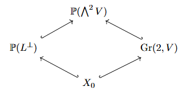
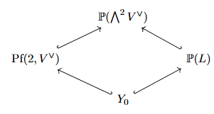
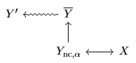

### Introduction
In mirror symmetry, one of the ways we approach the motivating conjectures (homological projective duality and general existence of mirrors for Calabi-Yau threefolds) is by collecting evidence, ie writing down invariants of Calabi-Yaus and their mirrors and finding different ways to calculate and compare them. For $X$ a simply connected Calabi-Yau threefold, there are a few types of invariants we are interested in: 
	- Diffeomorphism invariants 
		- Hodge numbers, especially $h^{1,1}(X) = \text{rk} \ H^2(X, \mathbb{Z})$ and $h^{2,1}(X) = \text{rk} \ H^3(X, \mathbb{Z})$ 
	- Invariants under change of Kähler structure
		- derived category of coherent sheaves $\mathsf{D}^{\flat}(\text{Coh}(X))$
	- Deformation invariants
		- Gromov-Witten, Donaldson-Thomas invariants
### Examples
Here are some examples of spaces with agreeing invariants: 
	1. Let $V$ be a 7-dimensional complex space, and consider the Grassmannian $\text{Gr}_2(V) \subseteq \mathbb{P}(\bigwedge^2 V).$ If $H$ is a hyperplane class in the Grassmannian, the space $X = \text{Gr}_2(V)\cap H^7$ has $K_X = \mathcal{O}_X$, $$h^{1,1} = 1, h^{2,1} = 50, H^{3} = 3, c_{2}\cdot H = 84$$
		(where $H^3 = 3H$ in the cohomology/Chow ring of $X$ and $c_2$ is the second Chern class). Let $\varphi : \mathbb{P}(V) \to \mathbb{P}(V^\vee)$ with $\varphi = -\varphi^\vee$ . Let $Y = D_4(\varphi) = \{x \ | \ \text{rk} \phi(x) \leq 4\}$. Then $X$ and $Y$ are not birational, but nonetheless $\mathsf{D}^{\flat}(\text{Coh}(X)) = \mathsf{D}^{\flat}(\text{Coh}(Y))$.
	2. (Reye congruence) Let $V$ be a 5-dimensional complex space, and let $\mathscr{X}$ be the Chow variety of two points in $\mathbb{P}(\text{Sym}^2(V))$. The image of the canonical morphism $\mathbb{P}(V) \xhookrightarrow{} \mathbb{P}(\text{Sym}^2(V))$ is a 4-plane determined by a linear system of 5 quadrics $|Q_1\dots Q_{5}|$, and if $\mathscr{H}$  is the locus of singular quadrics one has $\mathsf{D}^{\flat}(\text{Coh}(\mathscr{X})) = \mathsf{D}^{\flat}(\text{Coh}(\mathscr{H}))$.
	3. (Octic double solids) Let $X$ be a smooth complete intersection in $\mathbb{P}^7$, with invariants 
$$
h^{1,1} = 1, h^{2,1} = 65, H^3 = 16, c_{2} \cdot H = 64.
$$
	Let $Y \xrightarrow{2:1} \mathbb{P}^3$ be a double cover branched over 
$$
B = \{x \in \mathbb{P}^3 \ | \ \text{det}(A(x)) = 0\},
$$ 
where $A(x)$ is a matrix associated to $x$ in $M_3(\mathbb{C}[x])$. Then $Y$ is a singular Calabi-Yau threefold having 84 nodal singularities. $Y$ admits a noncompact crepant resolution to a projective space $(\mathbb{P}^3, \mathcal{B})$ equipped with a sheaf of Azumaya algebras, and $\mathsf{D}^{\flat}(\text{Coh}(X)) = \mathsf{D}^{\flat}(\text{Coh}(\mathbb{P}^3, \mathcal{B}))$. For another equivalence, $Y$ has an analytic crepant small resolution to a space $\hat{Y}$ with $\text{Br}(\hat{Y}) \cong \mathbb{Z} / 2\mathbb{Z}$, and with $\alpha$ the nontrivial class in the Brauer group one has $\mathsf{D}^{\flat}(\text{Coh}(X)) = \mathsf{D}^{\flat}(\text{Coh}(\hat{Y}, \alpha)).$ 

These examples are analysed in the literature using the GLSM formalism: 
	Example 1 is in [Hori Tong '07](https://arxiv.org/pdf/hep-th/0609032)
	Example 2 is in [Hori '13](https://arxiv.org/pdf/1104.2853)
	Example 3 is in [Calderaru et al '07](https://arxiv.org/pdf/0709.3855)
	Another famous example is the Orlov space, this in [Hori Herbst Page '08](https://arxiv.org/pdf/0803.2045)
A feature all of these examples have in common is that $h^{1,1} = 1$, how can we get examples with $h^{1,1} = 2$? $\to$ Genus one fibrations. 

### The GLSM formalism
A gauged linear sigma model (GLSM) is a 5-tuple of data $(G, \rho, R, W, t)$, where: 
	- $G$ is a compact Lie group
	- $\rho : G \to V$ is a faithful unitary representation of $G$
	- $R$ is a faithful unitary representation of $\mathsf{U}(1)$ (same target space as $\rho$)
	- $W$ is an element of the $G$-invariants ring $S^G$ of $S = \mathsf{Sym}^\bullet \ V^\vee$ with $R$-weight 2
	- $t$ is an element of $\mathcal{T} = \left( \frac{\mathfrak{t}_{\mathbb{C}}^\vee}{2\pi i \rho(\mathfrak{g})} \right)^{\mathcal{W}(T, G)}$ (this is called the **FI-theta parameter** in the physics literature)

For $\mu : V \to \mathfrak{g}^\vee$ the moment map and $\zeta \in \text{Re}(\mathcal{T})$ a regular value, the **Higgs branch** is a certain intersection $X_\zeta$ of the preimage $\mu^{-1}(\zeta)$ inside $V$ (what is it?). 

The **Coulomb branch** is the union of loci in $\mathcal{T}$ where the GLSM is singular (I think).

Set $\widetilde{W}_{\text{eff}}(\sigma, t) = -t(\sigma) + 2\pi i \rho_{W}(\sigma)\cdot\sum_{Q_{j} \in \mathfrak{h}^\vee} Q_{j}(\sigma)(\text{log}(Q_{j}(\sigma) - 1))$, where $t$ is as above and $\sigma \in \mathsf{Z}(\mathfrak{g}_{\mathbb{C}})$. Then the **stringy Kähler moduli space** is $\mathcal{M}_{K} = \mathcal{T} \setminus \Delta$, where $\Delta$ is the union of critical loci for $\widetilde{W}_{\text{eff}}^H$ over all subgroups $H$ of $G$. 

Remark: The real locus of the stringy moduli space has finitely many connected components $P_i$ called **phases**. By the relation between symplectic and GIT quotients, each phase is a possible linearisation for the GIT quotient. The imaginary locus has smoothness properties allowing one to interpolate through the real phases by passing through the imaginary locus. 
#### GLSM $\to$ D-branes (not used later)
A **brane** is a 4-tuple $B = (M, Q, \rho, r_*)$, where 
	- $M$ is a $\mathbb{Z} / 2\mathbb{Z}$-graded free $S$-module ($S$ as above)
	- $Q \in \text{End}^1_S(M)$ (this subscript usually indicates a distinguished subgroup of the endomorphism group)
	- $\rho_M : G \to GL(M)$ is a complex representation 
	- $r_{*} : U(1) \to GL(M)$ is a complex representation 
such that $Q^2 = W$, $Q$ is $G$-equivariant, etc. 

- There are limiting points $p_i$ attached to each phase above, which have associated triangulate categories $D_i$ (these are really associated to the Higgs branch of regular values in the phase). There are various conjectural equivalences of these $D_i$ to triangulated categories of algebraic invariants, depending on the branch. 
- <u>Conjecture:</u> There are essential surjections $\pi_i : D \to D_i$ (from total triangulated category to triangulated category of the phases) and natural equivalences $D_{i} \xrightarrow{\sim} D_{j}$.
- Define the **hemisphere partition function** 
$$
\begin{aligned}
Z_{D^2} &: K_{0}(D) \times \mathcal{M} \to \mathbb{C}, \\ 
Z_{D^2}([B], t) = &\int_{\gamma \subseteq \mathfrak{t}_{\mathbb{C}}}d^r\sigma \prod_{\alpha \in \prod^+} \alpha(\sigma)\sinh(\pi \alpha(\sigma)) \prod_{j=1}^m \Gamma\left( i Q_{j}(\sigma) + \frac{R_{j}}{2} \right)\exp(it \sigma) f_{B}(\sigma)
\end{aligned}
$$ 
( not sure what all of the parts here are).

<u>Conjecture:</u> To each limiting point $p_i$, there should be an associated cohomological field theory: 
	- a state space $H_i = HH_*(D_i)$ (Hochschild homology) with a pairing $\langle \  , \ \rangle: H_{i} \times H_{i} \to \mathbb{C}$
	- for all $i$, $Z_{D^2}([B], t) = \langle \text{ch}(\pi_{i}(B)), \hat{\Gamma}_{i} \circ J_{i}(t) \rangle$, where $\text{ch}$  is the Chern character, the $J_i \in H_i[t][[e^t]]$ are certain *J-functions* and $t \in P_i + (i \mathbb{R}/ \mathbb{Z})^{\text{dim}(\mathcal{M}_{K})}$.
#### Elliptic Fibrations
- In the following examples, we will use an **elliptic normal curve**. For our purposes, this is a smooth projective curve $E$ of genus 1 and degree $N \geq 3$, so that $E$ can be immersed in $\mathbb{P}^{N-1}$ with image not contained in a hyperplane.
	- Example: If $N = 3$, $E$ is a cubic in $\mathbb{P}^2$.
#### Pfaffian varieties
Let $A$ be a $(2r+1)$-dimensional square matrix, skew-symmetric with entries in $(\mathsf{Sym}^\bullet(x_0,\dots, x_{r}))_{1}$ (degree 1 polynomials in $r+1$ variables). Let $M_i$ be the $2r\times 2r$ minor obtained by deleting the $i$th row and column from $A$, $\text{pf}(M_{i})$ its **Pfaffian** (choice of square-root for $\text{det}(M_{i})$). We define the **Pfaffian variety** $D_{r}(A)$ of $A$ to be $V(\prod_{i=1}^{2r+1}\text{pf}(M_{i}))$, the vanishing locus of all of the Pfaffians. 

#### Homological projective duality for elliptic normal curves in degree 
Let $V$ be a 5-dimensional complex vector space, $L \subseteq \bigwedge^2 V^\vee$ a 5-dimensional subspace, $L^\perp$ its orthogonal complement. Then we have a diamond
 of inclusions with $X_0$ our elliptically fibred surface (I think ), the Plücker embedding from the Grassmannian and the induced map of projective spaces from the inclusion $L^\perp \subseteq \bigwedge^2 V$. The dual picture is the diamond , and we find that $\text{Pf}(2, V^\vee)$ is dual to the Grassmannian and that $\mathsf{D}^{\flat}(\text{Coh}(X_{0})) \cong \mathsf{D}^{\flat}(\text{Coh}(Y_{0})).$

In the GLSM version of this homological duality setup (see [Hori Knapp '13](https://arxiv.org/pdf/1308.6265)), $G = U(2)$ with stringy Kähler space $\mathcal{M}_{K} = \mathbb{C}^* / e^{-t}$, $e^{-t} = \frac{1}{2}(11 \pm 5\sqrt{5})$. The Higgs branch is $Y_0$.

### General Elliptic Fibration Picture
The correct setting for an elliptic fibration is a flat proper holomorphic surjection $\pi: X \twoheadrightarrow B$. There is a minimal integer $N > 0$ such that a divisor $D \subseteq X$ exists with $\pi|_{D} : D \xrightarrow{N : 1} B$ an $N$-fold cover. If $N = 1$, we call $\pi$ an **elliptic fibration**. Equivalently, there is a line bundle $L \to X$ with $\text{deg}(L|_{C}) = N$ for every fibre $C$ of $\pi$, $D\cdot C = N$ (has intersection multiplicity $N$).

<u>Intersection theory characterisation of Calabi-Yau elliptic fibrations</u> ([Oguiso '93](https://archive.mpim-bonn.mpg.de/id/eprint/382/1/preprint_1993_72.pdf)): Let $X$ be a smooth projective Calabi-Yau threefold, $D \geq 0$ a divisor on $X$ satisfying $D^3 = 0$, $D^2 \not \equiv 0$, $D\cdot c_{2} > 0$. Then there is a base space realising $X$ as an elliptic fibration. 

- People are interested in a physics interpretation of these examples for the modular bootstrap and for studying the topological string partition function 
- Knapp, Schimanneck and Scheidegger focus especially on the $N = 5$ elliptic normal curve because the Calabi-Yau cannot be realised as a singular toric variety (most known mirrors can)
- They constructed 13 pairs of such spaces and computed their Hodge numbers and other diffeomorphism invariants

<u>Theorem</u>([Knapp, Schimannek, Scheidegger '21](https://arxiv.org/pdf/2107.05647)): Let $\pi : X \to B$ a smooth projective Calabi-Yau threefold which is an elliptic fibration admitting a 5-section ( this should be equivalent to the fibres being degree 5 elliptic normal curves). Then: 
	- $X$ is a determinantal subvariety of a Grassmannian bundle
	- $X$, $\mathcal{M}_{K}$ can be studied using a $U(M)\times U(1)^n$ GLSM ($M$ a certain $D$-brane)
	- these fibrations come in pairs $(X, Y)$, which are **conjecturally mirror duals** 
	-   there is also a statement about Fourier-Mukai transforms I missed

### Open Questions 
( this summary should be close to correct but I'm kind of guessing what the notation means) In general, we so far usually have a picture as below: We have a mirror space $Y$ and an analytic non-Kähler resolution $\overline{Y}$, but we can get an associated algebro-geometric space by taking the noncommutative space associated to a nonzero element $\alpha \in \text{Br}(Y)$ which will have $\mathsf{D}^{\flat}(\text{Coh}(\overline{Y})) \cong \mathsf{D}^{\flat}(\text{Coh}(Y_{\text{nc}, \alpha}))$. Then we can pass to a smooth deformation $Y'$ of $\overline{Y}$. The correct and precise version of this is in [Thomas Calabrese '16](https://arxiv.org/pdf/1408.4063).

The things we want to know are: 
- What are the bounded derived categories of singular elliptic fibrations?
- Is it possible to calculate topological invariants using only the data of the $D$-brane? 
- Can we work out $\text{Br}(Y)$ and the noncommutative scheme structure from the GLSM? 
- Can we work out the Fourier-Mukai transform using matrix factorisation in the GLSM? 